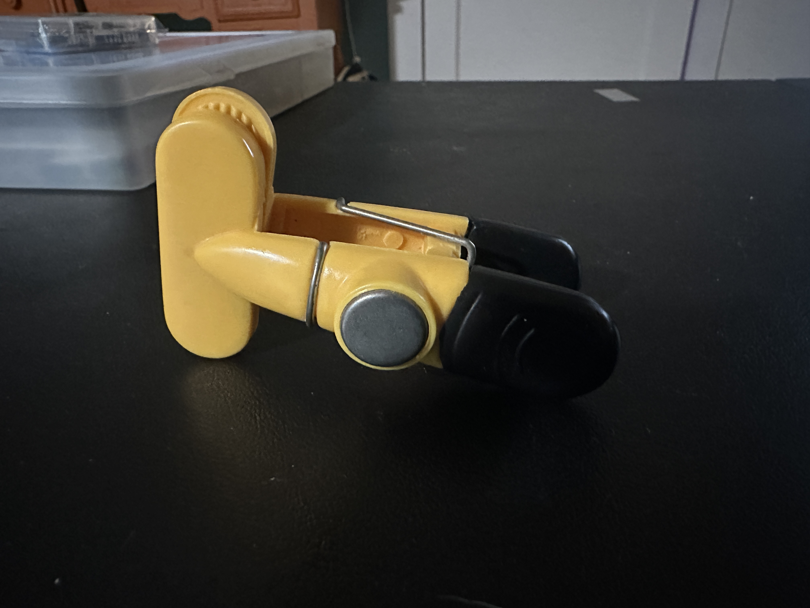
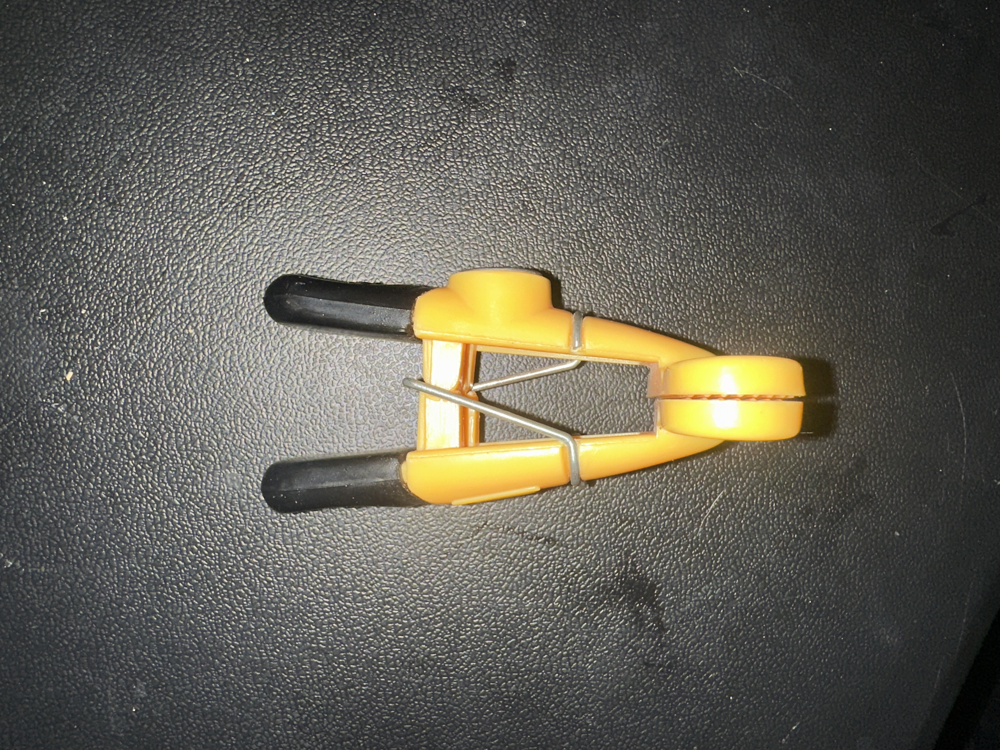
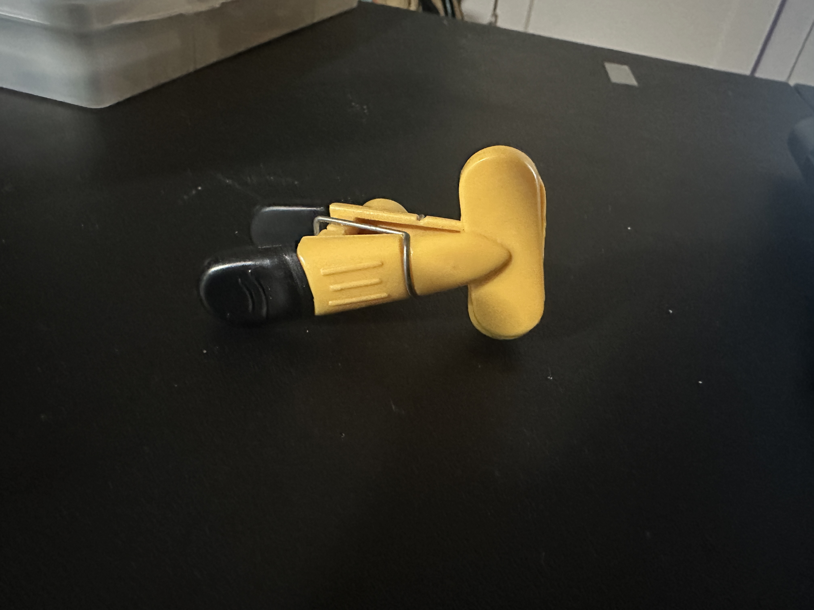

# A1 – Portfolio and Product Analysis

## Objective

This assignment analyzes two engineering portfolios and a simple mechanical product while documenting decisions about how my own portfolio will be organized and presented.

## Analyze

### Task A – Portfolio Analysis

#### Portfolio 1 – Neal Zalomek

The first portfolio I evaluated was Neal Zalomek’s, which I found on the Canvas reference page. It is a Canvas-based portfolio covering MEGR 2156 content.

**Navigability:**  
The portfolio has a neatly labeled homepage with direct links to each section, allowing a reader to locate a specific assignment in under 60 seconds.

**Reproducibility:**  
The portfolio includes detailed sketches, calculations, and computer-generated designs that provide enough information to understand how most of the work was completed. However, some of the handwritten calculations are difficult to read, which could make reproducing certain steps more difficult for another student or engineer.

**Evidence of Reasoning:**  
The portfolio shows calculations, sketches, and intermediate design work rather than only presenting final results. This allows the reader to see how the design developed.

**Professional Tone:**  
The portfolio uses complete explanations and engineering terminology that would be appropriate for presenting technical work to an employer or supervisor.

[Neal Zalomek's Portfolio](https://uncc.instructure.com/eportfolios/4602/home/landing-page)

#### Portfolio 2 – Matt Chestnut

The second portfolio I evaluated was Matt Chestnut’s, which is hosted on GitHub.

**Navigability:**  
The portfolio consists mainly of one page containing information about multiple projects. This can make locating a specific piece of work slower because the reader may have to scroll through several project descriptions instead of selecting a directly labeled assignment.

**Reproducibility:**  
The portfolio provides project overviews but does not include enough information about calculations, procedures, dimensions, or design steps for another person to independently recreate the work.

**Evidence of Reasoning:**  
The portfolio provides limited evidence of reasoning because it focuses more on final designs and project summaries than on explaining why specific design decisions were made.

**Professional Tone:**  
Some descriptions use informal wording and sentence fragments, which makes parts of the documentation less suitable for formal technical communication with an employer or engineering colleague.

[Matt Chestnut's Portfolio](https://wkmat.github.io/Portfolio/)

### Task B – Product Analysis

#### Primary Function

The primary function of the chip clip is to hold a bag closed by applying a clamping force. When the handles are squeezed together, the jaws open. When the handles are released, the metal spring pushes the jaws back together and holds the bag closed.

#### Governing Model

The governing model for the chip clip is a lever that rotates around a pivot point. When force is applied to the handles, the two sides rotate around the pivot and open the jaws.

The equation used to model the system is:

**Fₛdₛ = Fⱼdⱼ**

Where:

- **Fₛ** = force applied by the spring
- **dₛ** = distance from the pivot to the spring
- **Fⱼ** = force applied by the jaws
- **dⱼ** = distance from the pivot to the jaws

This equation shows how the force applied by the spring creates a force at the jaws. This force keeps the clip closed and the bag sealed. To open the clip, the user must apply enough force to overcome the force from the spring.

#### Assumption

One assumption I am making with this model is that there is very little or no friction at the pivot point. This makes the model simpler and allows me to focus mainly on the forces from the spring and the jaws.

#### Component Geometry

> **Note:** The spring on my chip clip is glued to the side of the clip, so I could not fully disassemble the product without damaging it. Because of this, the component photos were taken from different angles while the clip remained assembled.

### First Plastic Half

*Figure 1. First plastic half of the chip clip.*

The first plastic half acts as both a handle and one side of the jaw. It also has a magnet for easy storage when not in use. Pushing the handle causes the part to rotate and the jaw to open.

### Spring

*Figure 2. Spring located in the middle of the chip clip.*

The spring in the middle keeps the clip closed. When the handles are squeezed, the spring is forced out of its normal position. When the handles are released, the spring pushes the clip closed again.

### Second Plastic Half

*Figure 3. Other plastic half of the chip clip.*

The other side of the clip works with the first half to grip the bag between the two jaws.

#### Patent Information

**Patent Number:** US5802677A  
**Inventors:** John G. Dorman, Gordon Isenga, and Russell O. Blanchard

One alternative to this chip clip would be a more clothespin-style clip that uses a traditional coil spring instead of the V- or U-shaped spring used in this design.

Another alternative could be a binder clip, which does not use a separate coil spring. Instead, the bent spring-steel body provides the force that keeps the clip closed.

One design decision in this patent is that the spring is shaped so that it pushes the two jaws together. This gives the clip enough force to hold the bag closed while still allowing the user to open it by squeezing the handles.

[US5802677A – Google Patents](https://patents.google.com/patent/US5802677A/en)

## Decide

### Homepage Identity

I want the homepage to have a simple and easy-to-follow design so that a visitor can quickly understand what the portfolio contains and where to find each assignment. The homepage clearly states that this is an engineering portfolio for MEGR 2156 and directs the reader to the different assignments without adding unnecessary information.

### One Intentional Customization

I changed the section title **“Semester arc”** to **“Class Schedule.”** I made this change because “Class Schedule” is simpler and makes it easier to tell what the section is about. The new title helps the reader understand that this part shows how the class is organized throughout the semester.

### Documentation Standard

I will make sure every assignment is clearly documented, organized, and easy for someone else to understand.

## Communicate

### Riley Gardner

Defending an engineering decision means providing enough evidence and reasoning to show why a decision makes sense. The decision should be logical and supported by science, mathematics, testing, or other engineering principles rather than just personal opinion.

### Time Spent

I spent approximately **4 hours** completing this assignment.
