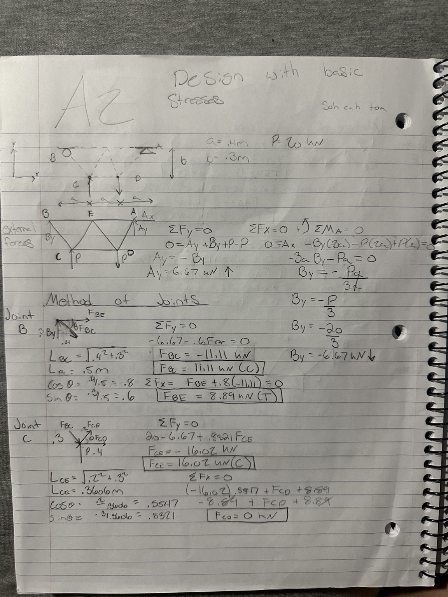
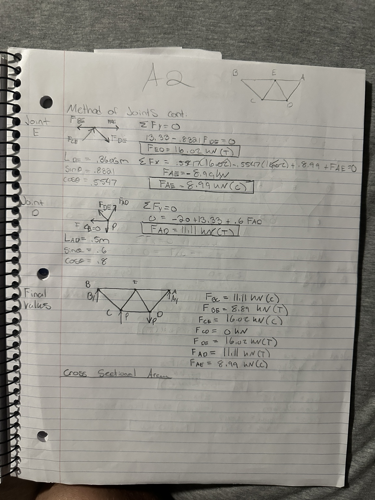
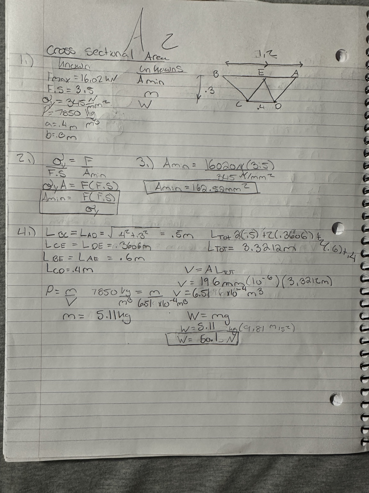
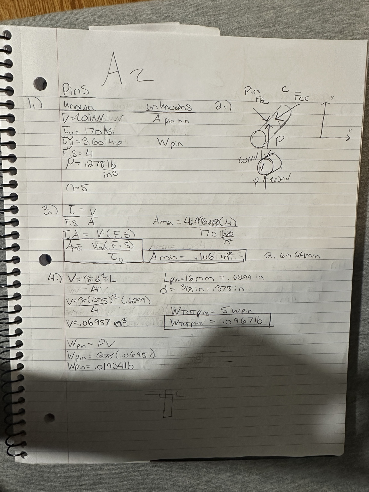
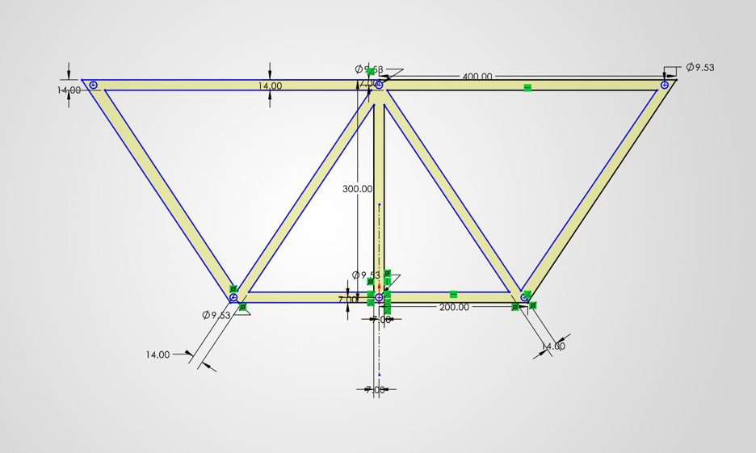
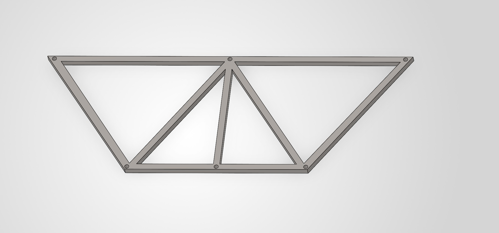

# A2 – Truss Stress Analysis

## Objective

The objective of this assignment was to design and analyze a truss system. I used P = 20 kN with the required dimensions of a = 0.4 m and b = 0.3 m. The goal was to calculate the forces in the truss, size the members and pins with the required safety factors, and then turn the design into a working CAD model.

## Analyze

### Part 1 — Truss Design and Internal Forces

I chose a simple five-joint, seven-member truss using triangular sections. I started by drawing a free-body diagram of the entire truss to find the reactions at supports A and B. I then used the method of joints and ΣFx = 0 and ΣFy = 0 to solve symbolically and numerically for the forces in each member.

The largest internal force I calculated was 16.02 kN in members CE and DE. I also found that CD was a zero-force member, which I did not expect when I originally chose the geometry. This showed me that adding a member does not necessarily mean it will carry part of the load.

### Part 2 — Cross-Sectional Area and Truss Weight

I used the largest internal force of 16.02 kN, the yield strength of A500 steel, and a safety factor of 3.5 to determine the minimum cross-sectional area. I first solved for the required area symbolically using:

Amin = Fmax(F.S.) / σy

My numerical calculation gave a minimum area of about 162.6 mm².

Instead of using exactly 162.6 mm², I chose a 14 mm × 14 mm square member, giving an area of 196 mm². The larger area still satisfies the safety requirement and gave me much cleaner dimensions to work with. I originally tried working closer to the calculated minimum, but the odd dimensions became difficult to use, especially once I started creating the CAD model.

I then added the lengths of all seven members and used the cross-sectional area and density of steel to estimate the total truss weight. My hand-calculated weight was approximately 11.36 lb. This gave me a value that I could later compare to the mass properties of my CAD model.

### Part 3 — Pin Design

I designed the connecting pins using hardened tool steel with a yield shear strength of 170 ksi, a density of 0.278 lb/in³, and a safety factor of 4. I drew a free-body diagram of the critical pin and treated the pins as single-shear connections. I used the largest expected force so that every identical pin would be designed for the worst-case loading condition.

I solved for the minimum pin area using:

Amin = Vmax(F.S.) / τy

My calculation gave a minimum pin area of approximately 0.106 in². I selected a 3/8-in diameter pin and used the pin dimensions and material density to estimate the combined weight of all five pins as approximately 0.0967 lb. Using the same pin at every joint also made the final design simpler.

## Decide

I selected a five-joint, seven-member truss with three joints across the top and two across the bottom. I chose triangular sections because they create a strong and stable truss while keeping the geometry simple enough to analyze and model.

One of the biggest differences in this assignment was having to choose the design myself. In most statics problems, I am given the geometry and only need to solve the math. Here, my geometry affected the forces, member sizes, weight, and eventually the CAD model, so there was more trial and error involved than simply finding the correct numerical answer.

## CAD Model

After finishing the calculations, I modeled the truss in CAD as one part and modeled the pins separately as cylinders. The image above shows the main dimensions used to create the model. I used the required 400 mm and 300 mm dimensions along with the 14 mm × 14 mm member dimensions selected from my calculations. The pin holes were also modeled using the dimensions determined from the pin calculations.

One important part of the CAD model was maintaining the cross-sectional area of the members at the pin-joint intersections. I had to make sure the members connected correctly while still maintaining the geometry and dimensions required by the design. This was more difficult than the hand calculations because I had to consider how the members and pins would actually fit together instead of only solving for forces and areas on paper.

The image above shows the finished truss part. The truss minus the pins was created as one part as required, while the pins were modeled separately as cylinders. The finished model uses the dimensions determined from my calculations while maintaining the required geometry and identical member cross sections.

The CAD portion was probably the most difficult part of the project. I originally tried building the truss in Creo, but I kept running into problems getting the model to work the way I wanted. After spending a lot of time troubleshooting it, I decided to switch to SolidWorks even though I had never used SolidWorks before.

Learning SolidWorks while finishing the assignment added another challenge, but I eventually found it easier to create the geometry I needed. This was also where I realized that getting an answer mathematically does not mean the design will immediately be easy to model. I had to think about the actual intersections, pin holes, dimensions, and how all the members would connect.

### CAD Weight Comparison

I used the mass properties in SolidWorks to determine the predicted weight of my finished CAD model. My hand-calculated truss weight was approximately 11.36 lb, while SolidWorks predicted a weight of 9.77 lb.

The difference between the two values comes partly from the hand calculations treating the members as simple lengths with a constant cross section, while the CAD model includes the actual joint geometry and pin holes. I was also unable to find A500 steel in SolidWorks, so I used AISI 1020 steel instead. The material is similar but not exactly the same, which can also contribute to the difference between the hand calculation and CAD prediction.

## Communicate — Engineering Lessons Learned

One of the biggest lessons I learned was that designing a structure is more complicated than solving a statics problem that already has a defined geometry. I had to make a design choice first and then use the calculations to determine whether that choice actually worked. Changes that seemed small at the beginning affected the force calculations, dimensions, weight, and CAD model later.

I also learned how yield strength and safety factors directly affect the physical dimensions of a design. My calculated minimum area was 162.6 mm², but choosing a practical 14 mm × 14 mm member gave me 196 mm². This kept the member above the required minimum area while giving me dimensions that were much easier to work with in CAD.

The CAD problems were another major lesson. Switching from Creo to SolidWorks for the first time forced me to adapt instead of continuing with a program that was slowing down the project. It also showed me that CAD is more than drawing the answer from my calculations because I had to consider how the members and pins would physically connect.

Finally, finding a zero-force member showed me how important geometry is in a truss. I originally expected every member to carry a load, but the analysis showed that CD carried zero force under this loading condition. That result helped me better understand how forces actually move through a truss instead of relying only on what the structure looks like.

## Time Spent

Total time from start to finish was approximately 6 hours.

A large portion of my time was spent on the CAD portion because of the problems I had with Creo and then learning SolidWorks for the first time. I originally expected the calculations to take up most of my time, but troubleshooting and turning the calculations into an actual design took much longer than expected.

Another lesson I learned was the importance of managing time during the design process. I spent too much time trying to make Creo work before deciding to switch to SolidWorks. Looking back, recognizing earlier that my original approach was not working would have saved time. This project showed me that time is also a constraint in engineering, and sometimes changing approaches is more efficient than continuing to troubleshoot the same problem.

## CAD Files

The completed SolidWorks CAD files can be downloaded below:

[Download Truss SolidWorks Part](Part1.SLDPRT)

[Download Pin SolidWorks Part](Pin.SLDPRT)
