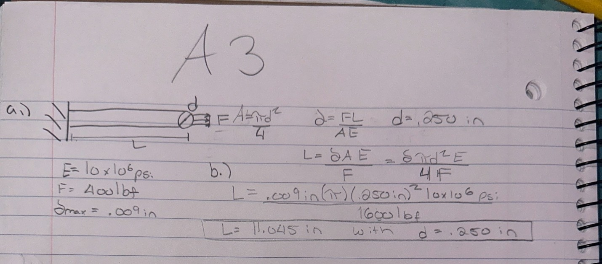
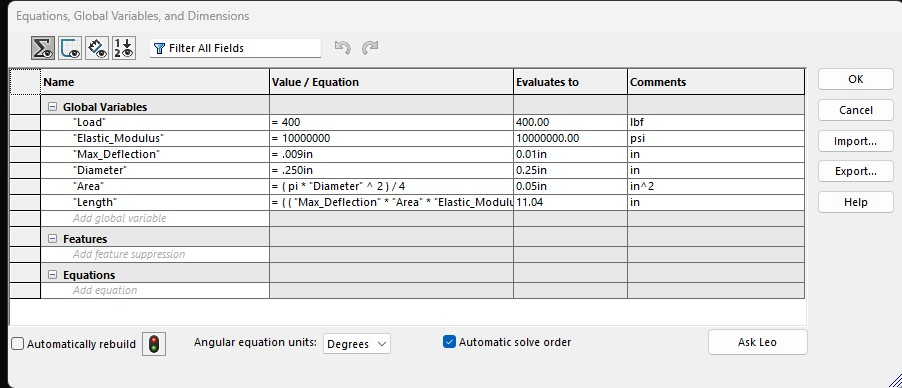
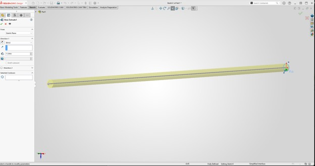
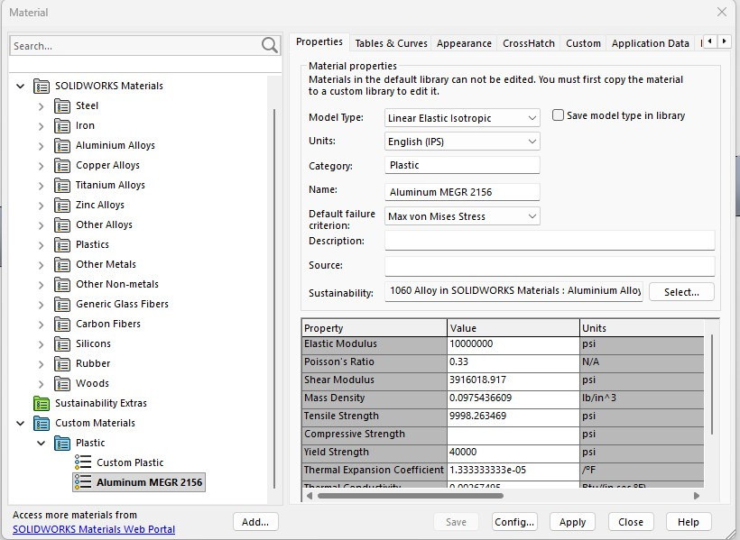
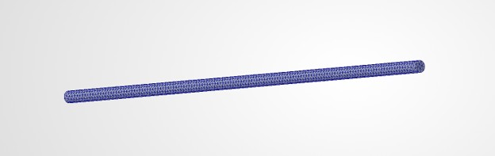
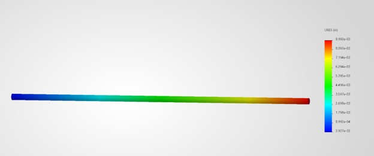
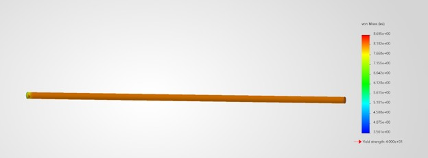
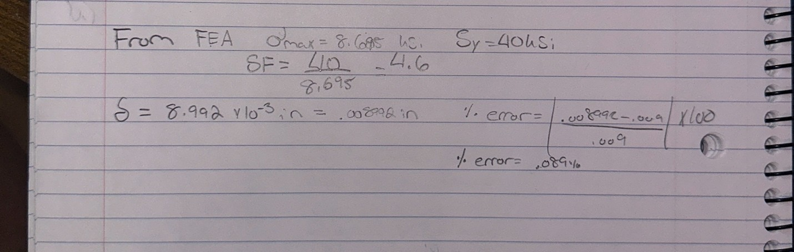
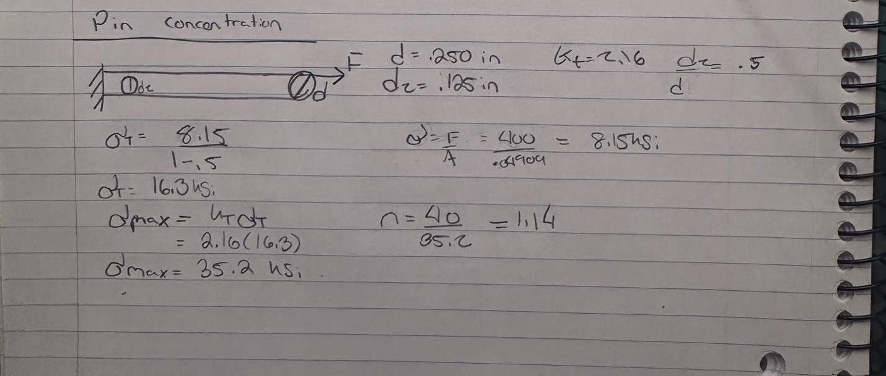

# A3 – Parametric Design and FEA

## Objective

The goal of this assignment was to design an aluminum bar for stiffness using both parametric modeling and finite element analysis. I used the axial deflection equation to determine the bar geometry, built the model parametrically in SolidWorks, and then verified the design by comparing the hand calculation with FEA stress and displacement results.

---

## Analyze

### Design Requirements, Cross-Section, and Hand Calculation

The bar was designed from aluminum with a maximum axial deflection of 0.009 in and an applied tensile load between 300 and 500 lbf. I selected a 400 lbf load, a Young’s Modulus of 10.0 × 10^6 psi, and a circular diameter of 0.250 in, giving a cross-sectional area of approximately 0.04909 in².

Using the direct-tension equation:

δ = FL / AE

and solving for length:

L = δAE / F

the required bar length was calculated to be approximately 11.045 in.

### Parametric CAD Setup and Model Verification

In SolidWorks, I created global variables for load, elastic modulus, maximum deflection, diameter, area, and length. The circular sketch diameter was linked to the Diameter variable, while the extrusion depth was linked to the calculated Length variable so the geometry would update automatically. I temporarily changed one design parameter to verify that the model was parametric, then returned it to the final geometry of 0.250 in diameter and approximately 11.045 in length.

### Material Selection

The original SolidWorks aluminum material was close to the required stiffness, but some of its properties did not match the assignment values. I created a custom aluminum material so the Elastic Modulus, Poisson’s ratio, density, and yield strength could be set to the required values, including an Elastic Modulus of approximately 10.0 × 10^6 psi and a yield strength of 40 ksi.

### FEA Setup, Boundary Conditions, and Mesh

A static FEA study was created using the same 400 lbf load and bar geometry from the parametric design. One circular end face was fixed, a 400 lbf axial tensile force was applied to the opposite face, and SolidWorks generated the finite-element mesh before solving.

### Deflection Map

The SolidWorks displacement plot showed a maximum resultant displacement of 0.008992 in at the loaded end. The displacement increased smoothly from nearly zero at the fixed end to the maximum value at the opposite end, which matches the expected axial deformation.

### von Mises Stress Map

The maximum von Mises stress from the FEA was approximately 8.695 ksi. Most of the bar showed a relatively uniform stress distribution because the geometry has a constant circular cross section and is subjected to direct tension.

---

## Decide

### Strength, Safety Factor, and Deflection Comparison

The maximum FEA stress of 8.695 ksi was below the specified aluminum yield strength of 40 ksi.

The safety factor was calculated using:

Safety Factor = Yield Strength / Maximum Stress

n = 4.60

The hand-calculated deflection was 0.009000 in compared with 0.008992 in from FEA.

Percent Difference = 0.089%

### Explanation of Agreement

The analytical and FEA results are nearly identical because the bar has a uniform circular cross section and is subjected to simple axial loading with no major stress concentrations. The small difference is most likely caused by mesh approximation, numerical rounding, and small differences in how the software solves the model.

### Which Result I Trust

For this simple geometry, I would trust the analytical calculation slightly more for overall axial deflection because the bar closely matches the assumptions of the direct-tension equation. The FEA is still valuable because it verifies the calculation and provides the stress and displacement distributions throughout the model.

### Pin-Hole Stress Concentration

I assumed a 0.125 in pin hole, which is half of the 0.250 in bar width, giving d/W = 0.50 and Kt ≈ 2.16. The estimated peak stress increases to about 35.2 ksi, giving a safety factor of about 1.14. The design would still remain below the 40 ksi yield strength, but the safety margin would be much smaller.

---

## Communicate

### Mistakes / Troubleshooting

One issue I encountered was entering force units directly into the SolidWorks global-variable equations, which SolidWorks did not accept as expected. I corrected this by using consistent numerical IPS values for the equations and documenting the associated units separately.

Another issue was that the original SolidWorks aluminum material did not exactly match the required properties. I solved this by creating a custom material with the correct elastic modulus and 40 ksi yield strength.

### Lessons Learned

This assignment helped me understand how load, cross-sectional area, elastic modulus, and length are related through axial deformation. It also showed how parametric CAD and FEA can be used together to design and verify a component.

### Time Spent

The total time spent on this assignment was approximately 3 hours. This included hand calculations, parametric CAD modeling, material setup, FEA setup, troubleshooting, and analyzing the final results.

### CAD File

The completed SolidWorks part can be downloaded below:

[Download ParametricBeam.SLDPRT](ParametricBeam.SLDPRT)
