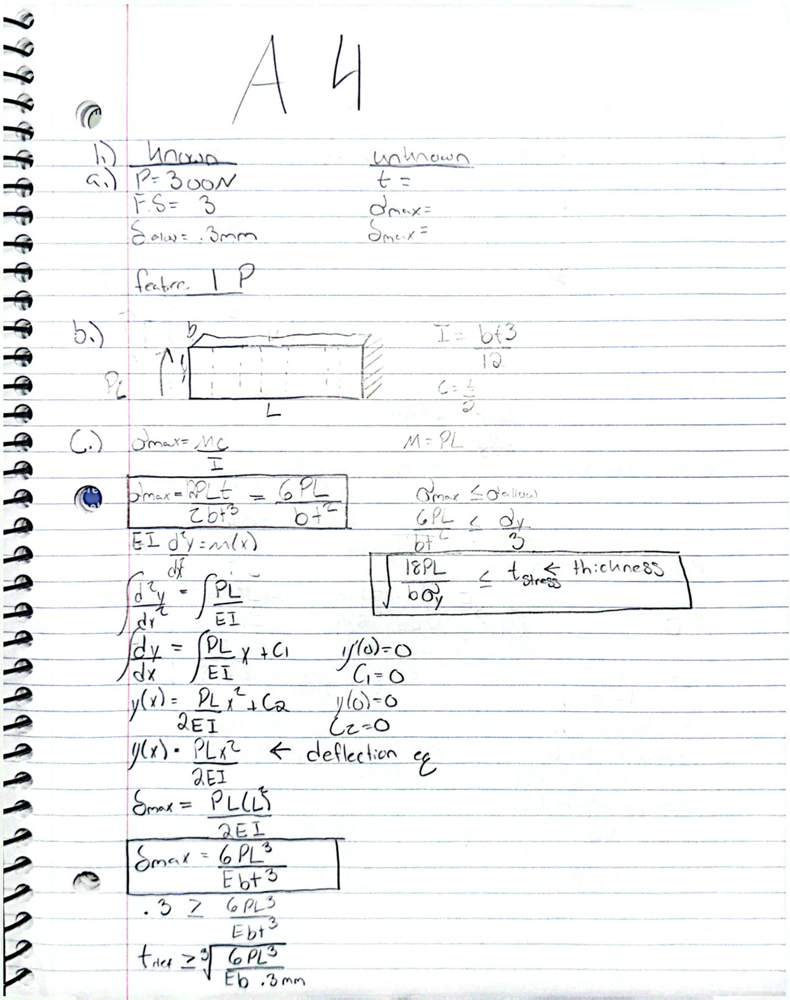
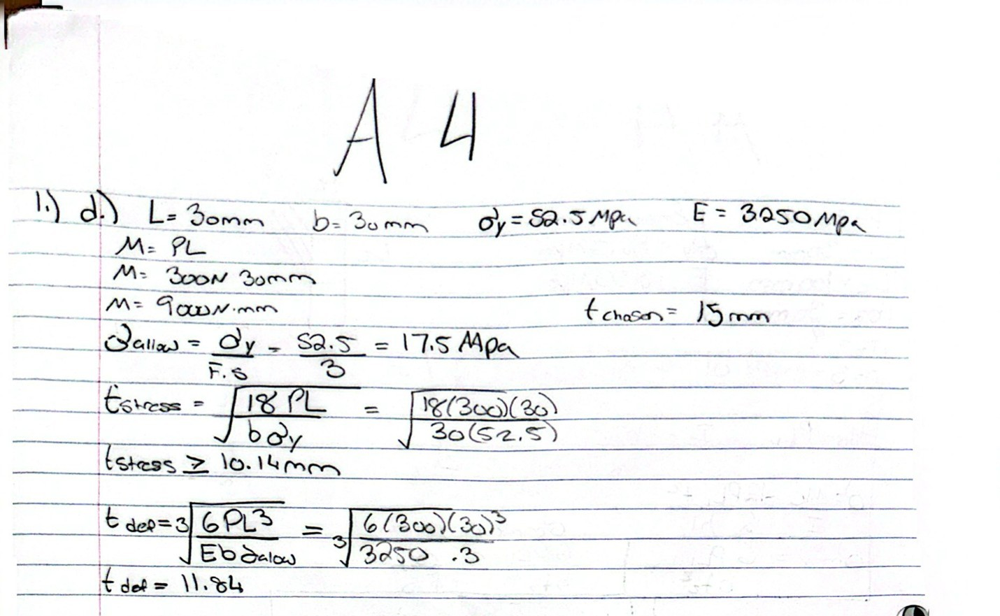
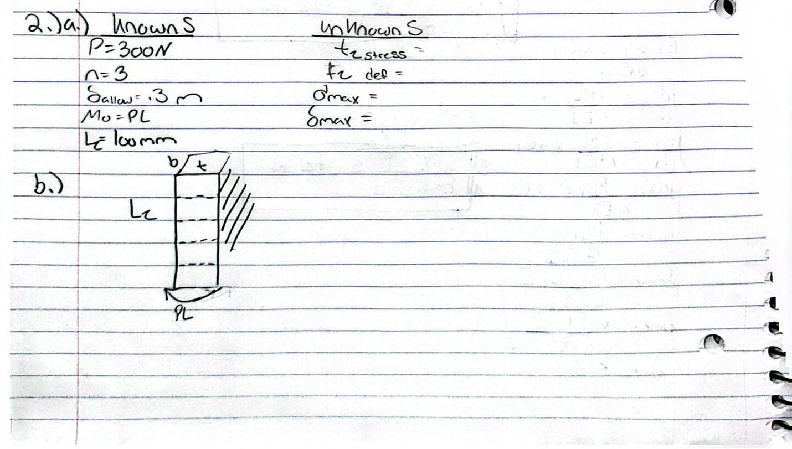
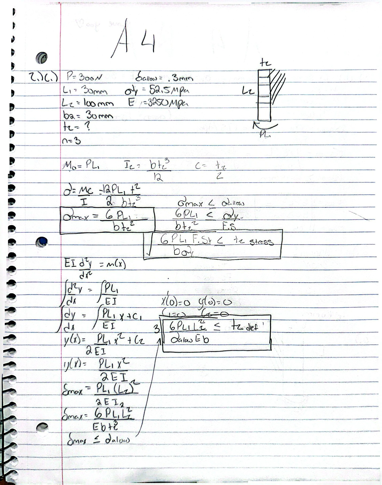
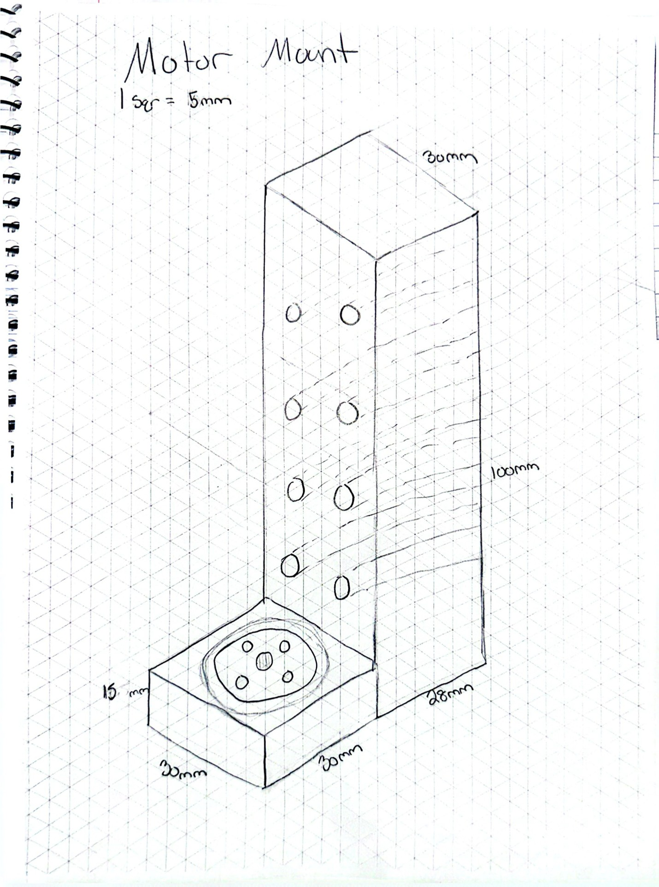
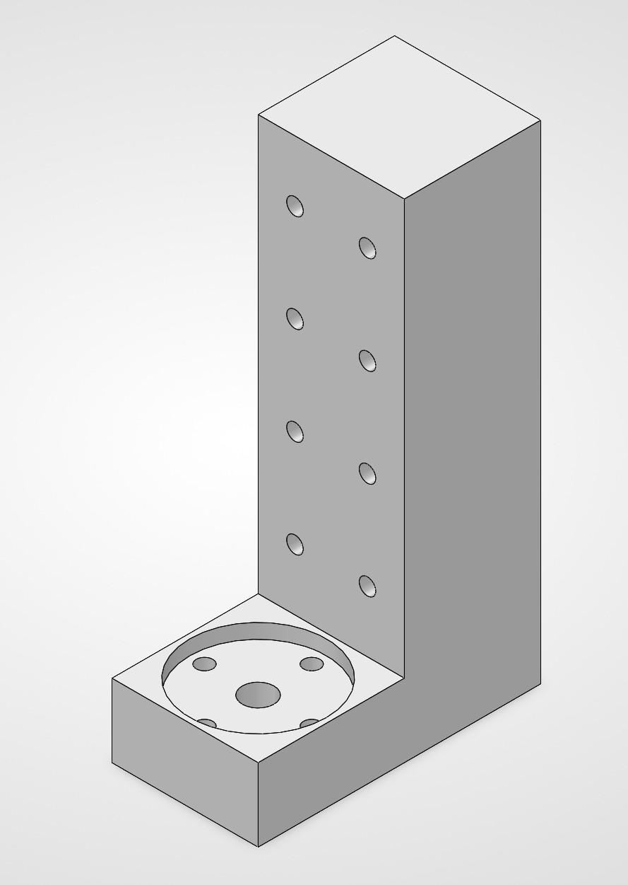

# A4 – Motor Mount

## Objective

For this assignment, I designed a motor mount for the specified 24V DC gear motor that attaches to rigid wall A. I separated the mount into Feature 1, which supports and attaches to the motor, and Feature 2, which connects the mount to the wall. I used beam bending equations to check both features for yielding and a maximum deflection of 0.30 mm under the given 300 N load with a safety factor of 3. After completing the calculations, I made an isometric sketch and then created the final design in SolidWorks.

### Material Selection

I selected PLA as the material for the motor mount. For my calculations, I used a yield strength of 52.5 MPa and a Young's modulus of 3250 MPa. These properties were used in both the stress and deflection calculations for Feature 1 and Feature 2.

## Analyze

### Feature 1 – Motor Attachment

Feature 1 is the horizontal section of the mount that supports and attaches to the motor. I modeled this section as a cantilever beam and created a free-body diagram showing the moment caused by the 300 N load. I then used the beam bending stress and deflection equations to determine the required cross-sectional geometry. Based on the calculations and my final design, I selected a 15 mm thickness for Feature 1. The rest of the geometry was based on the dimensions of the actual motor so that it could be mounted securely.

### Feature 2 – Wall Attachment

Feature 2 is the vertical section of the mount that attaches the design to rigid wall A. I modeled the unsupported section as a cantilever with the moment from Feature 1 transferred into it. I again checked both bending stress and deflection using the PLA material properties. Because Feature 2 has a much longer unsupported length of 100 mm, deflection became the controlling requirement. Based on the analysis, I selected a final thickness of 28 mm for Feature 2.

### Mistakes and Design Changes

One of the main difficulties I had was determining the correct thickness for each feature from the stress and deflection equations. I originally expected the wall section to be much thinner, but the deflection analysis showed that its 100 mm unsupported length required a much larger thickness. I also made changes while creating the CAD model so that the mount would better match the actual motor geometry and provide partial support around the motor.

## Decide

### Isometric Sketch

After completing the calculations for both features, I created an isometric sketch of the full motor mount. The sketch used the final 15 mm thickness for Feature 1 and 28 mm thickness for Feature 2 and helped me determine how the two sections would connect before beginning the SolidWorks model. I also included the important motor, shaft, bolt, and wall-mounting locations in the sketch.

### Design Features to Minimize Deflection

The overall geometry of the mount was chosen to help limit deflection while still fitting the specific motor. Feature 1 was kept relatively short and given a 15 mm thickness to create a stiff support directly underneath the motor. Feature 2 was made 28 mm thick because its longer unsupported length made it more sensitive to bending. The motor-support geometry also follows the shape and dimensions of the motor and partially surrounds it, allowing the mount to provide support close to the motor instead of extending the load farther away from the structure.

### Final Design

The final design is a PLA motor mount consisting of a 15 mm thick motor-support feature and a 28 mm thick wall-support feature. The design was created specifically around the dimensions of the assigned gear motor and includes a partial motor cover, shaft clearance, four M3 motor mounting holes, and holes for attaching the bracket to the rigid wall. The final geometry combines the results of the beam analysis with the physical dimensions needed to properly mount the motor.

## Communicate

### CAD Model and Parametric Design

I created the final motor mount in SolidWorks using the dimensions from my calculations and the dimensions of the actual motor. The motor-support area was designed around the motor geometry so that the mount provides a partial cover around the motor rather than only supporting it on a flat surface. I included the shaft opening and the required 3.4 mm clearance holes for the M3 bolts. For the parametric portion of the design, I created an M3 global parameter and used it to dimension the bolt holes throughout the model. I did not create global parameters for every dimension because most of the other dimensions were only used once, so linking them would not have added much benefit.

### Lessons Learned

This assignment helped me understand the full design process from analysis to a finished part. I learned how to use beam equations to guide important design decisions, especially when choosing the thickness of each feature. I was surprised by how much thicker Feature 2 needed to be because of its longer unsupported length and larger deflection. Turning the results into an isometric sketch and then into a SolidWorks model also made it easier to see how a design develops from equations into a real part. Overall, the assignment gave me a better understanding of how calculations, sketches, and CAD work together to create a practical design.

### Time Spent

The total time spent on this assignment was approximately 4–5 hours. This included reviewing the assignment, researching the motor and material, completing the calculations, creating the isometric sketch, and building the SolidWorks model.

### Research and References

StepperOnline Brushed 24V DC Gear Motor:  
https://www.omc-stepperonline.com/brushed-24v-dc-gear-motor-3-6kg-cm-46rpm-w-99-5-1-planetary-gearbox-pa28-28245800-g100

Ultimaker PLA Material Properties:  
https://ultimaker.com/materials/pla/

### CAD File Download

[Download MotorMount.SLDPRT](MotorMount.SLDPRT)
