# A5 – Design for Strength and Stiffness 

## Objective

The purpose of this assignment was to design a bracket capable of supporting a horizontal strap load using principles from statics and strength of materials. The bracket was divided into five separate features, labeled A through E, and each feature was analyzed individually. Reaction forces from one feature were carried into the next feature so that the load could be traced through the bracket until it reached the rigid T-beam. Both stress and stiffness analyses were completed to determine the minimum required dimensions for each feature.

For the design, a strap force of 600 lbf was selected. Because the strap applies the load symmetrically, the total load used at the beginning of the analysis was 1200 lbf. Ti-6Al-4V titanium was selected because it had the highest strength of the three available material choices. A yield strength of 128,000 psi, an elastic modulus of 16.5 × 10^6 psi, and a factor of safety of 4 were used. This resulted in an allowable stress of 32,000 psi. For the stiffness analysis, each feature was designed so that its deformation did not exceed 0.005 in.

## Analyze

### Calculating Dimensions from Stress Analysis

The first portion of the design process focused on determining the minimum dimensions required to prevent yielding. A separate free body diagram was created for each of the five features. The reaction forces calculated from one feature were then used as the applied loads for the next feature in the load path. Depending on the geometry of each feature, either axial normal stress or bending stress equations were used. For each feature, the known values, unknown dimension, assumptions, free body diagram, algebraic model, and numerical solution are shown in the calculations below.

Feature A was modeled as a circular cantilever beam carrying the full 1200-lbf strap load. Feature B was modeled as an axially loaded rectangular member carrying the reaction from Feature A. Feature C was modeled as a simply supported beam with a concentrated 1200-lbf load at its center, as specified by the assignment. Because of symmetry, the reactions at each end of Feature C were 600 lbf. These reactions were then carried into Features D and E. Feature D was modeled as an axial member, while Feature E was modeled as a short cantilever member.

The minimum dimensions calculated from the stress analysis were 0.726 in for Feature A, 0.050 in for Feature B, 0.433 in for Feature C, 0.025 in for Feature D, and 0.274 in for Feature E. These values represent the minimum dimensions needed to keep the calculated stresses below the allowable stress of 32,000 psi using the required factor of safety of 4.

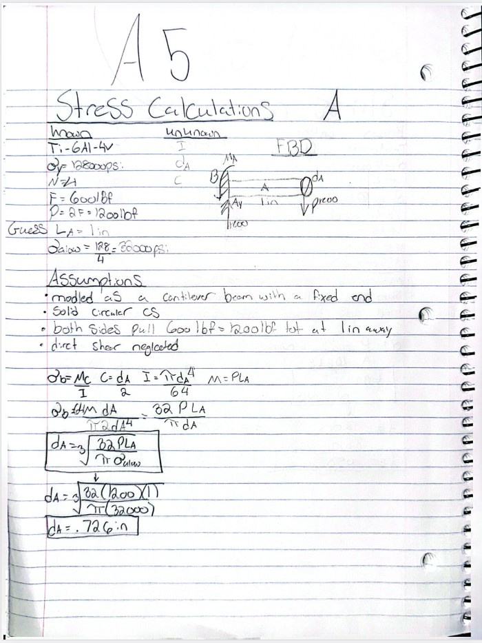

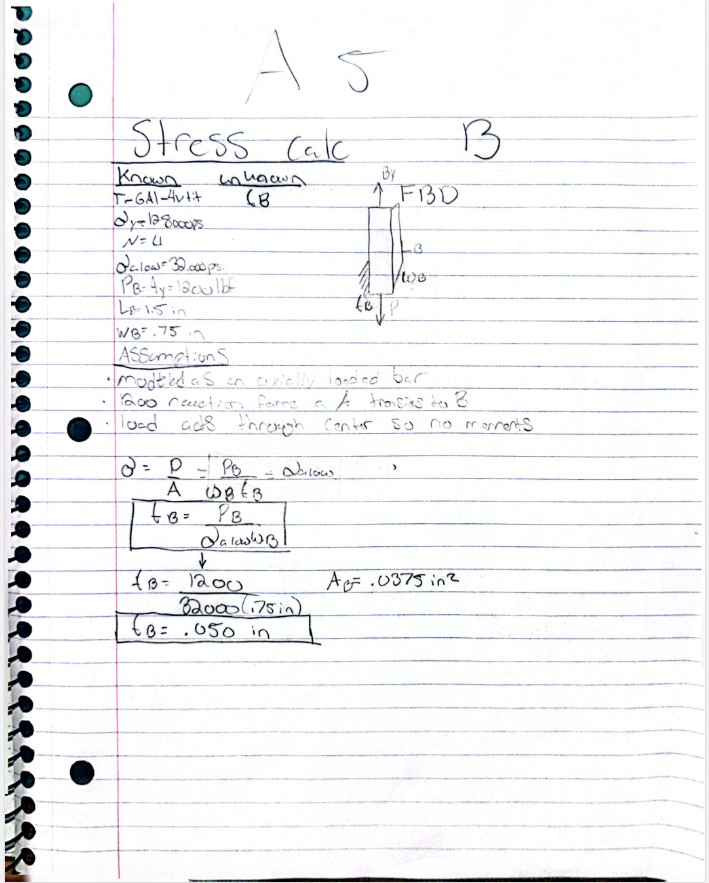

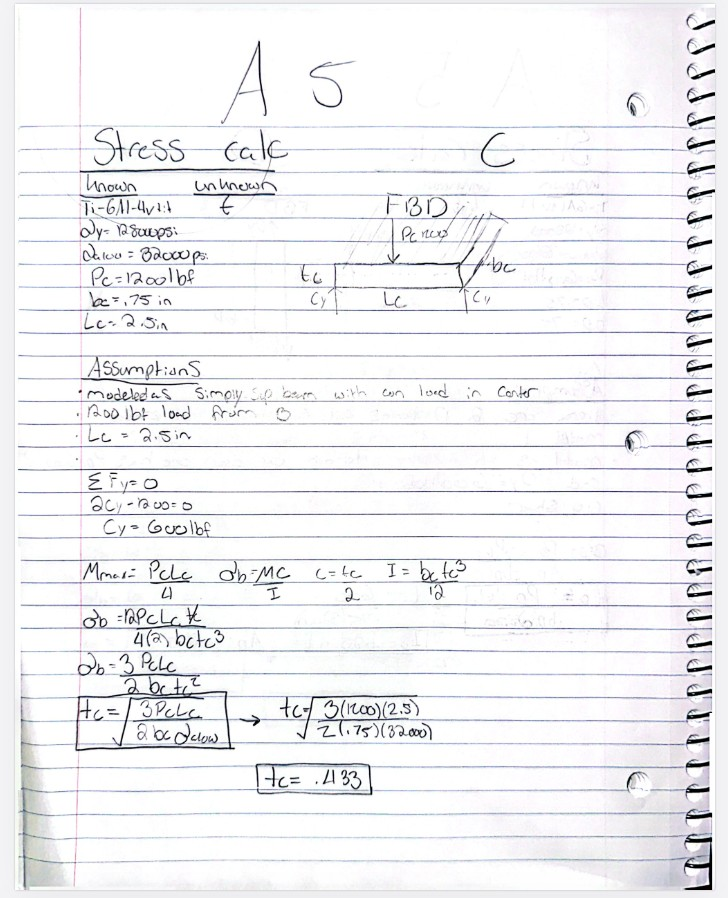

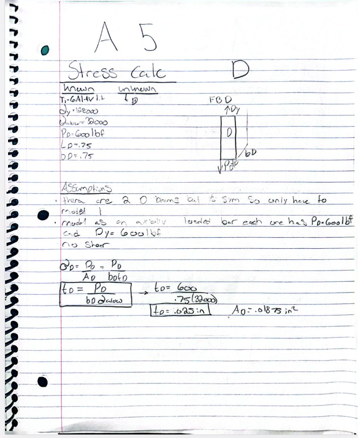

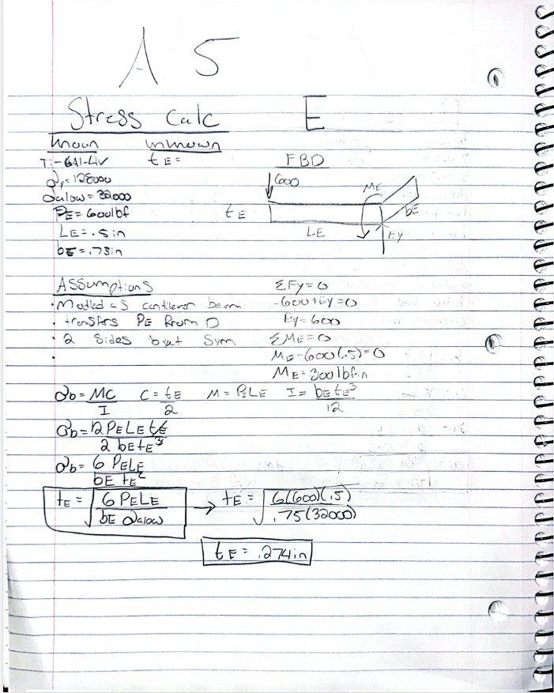

### Calculating Dimensions from Stiffness Analysis

The second portion of the design process used the same load path but sized each feature based on deformation instead of yielding. The maximum allowable deformation for each feature was 0.005 in, and shear deformation was neglected as instructed. Bending-deflection equations were used for the beam-like features, while axial-deformation equations were used for members carrying primarily axial loads. The calculations below include the known values, unknown dimension, assumptions, free body diagram, algebraic deflection model, and numerical solution for each feature.

Feature A was analyzed as a cantilever beam using the cantilever end-load deflection equation. Features B and D were analyzed using the axial deformation equation. Feature C was analyzed as a simply supported beam with a concentrated center load, and Feature E was analyzed as a short cantilever beam. The minimum dimensions obtained from the stiffness analysis were 0.561 in for Feature A, 0.0291 in for Feature B, 0.423 in for Feature C, 0.00727 in for Feature D, and 0.169 in for Feature E. These values were then compared with the dimensions obtained from the stress analysis.

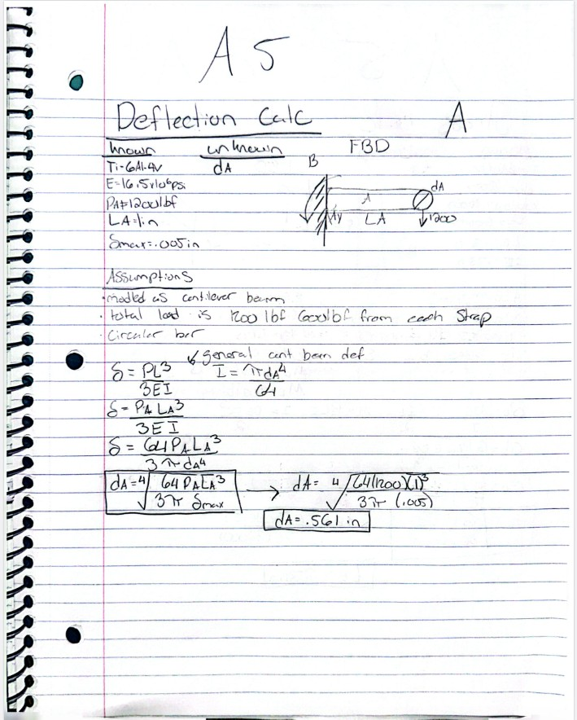

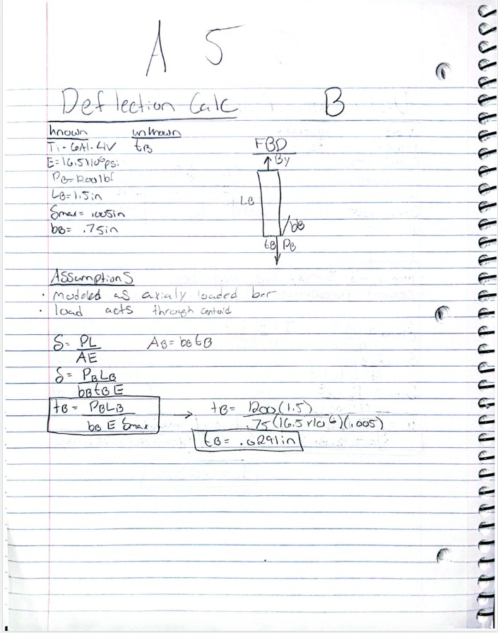

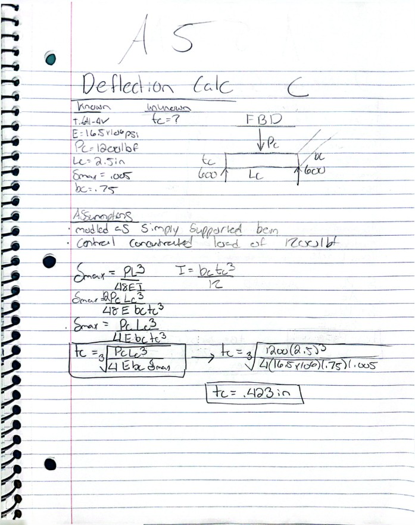

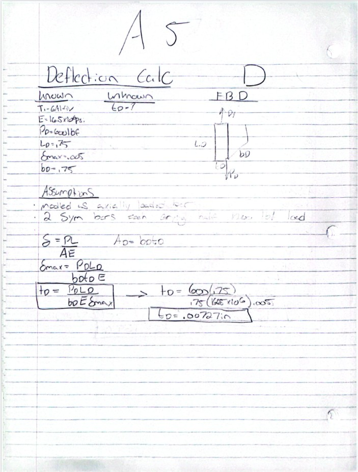

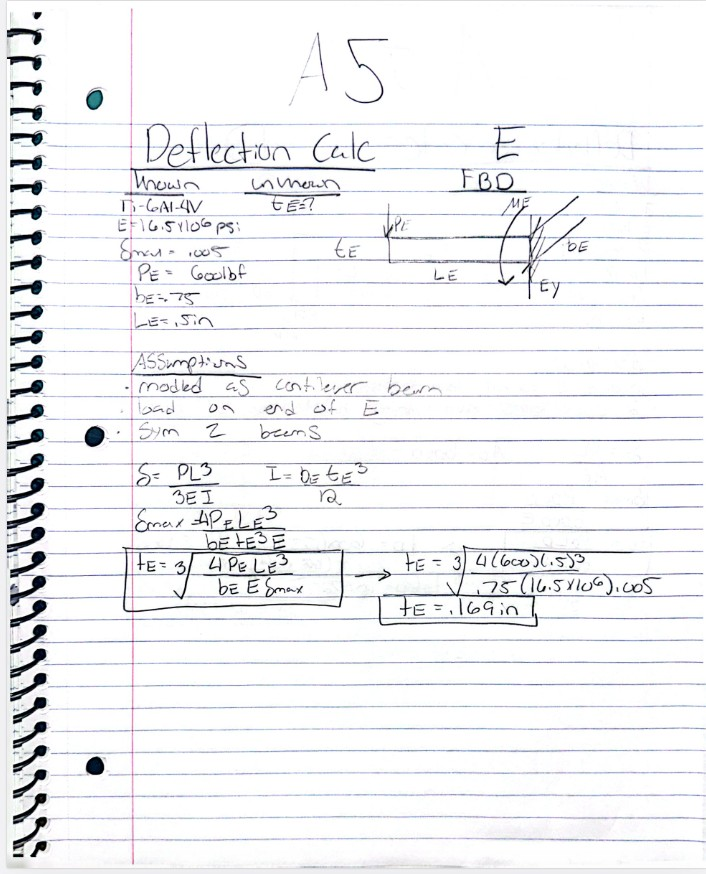

## Decide
### Generate Multiview Sketches

Two separate multiview sketches were created to document the dimensions obtained from the calculations. The first sketch shows the dimensions determined from the stress analysis, while the second sketch shows the dimensions determined from the stiffness analysis. Keeping the two sets of dimensions separate made it easier to compare the results and see which analysis controlled the required size of each feature.

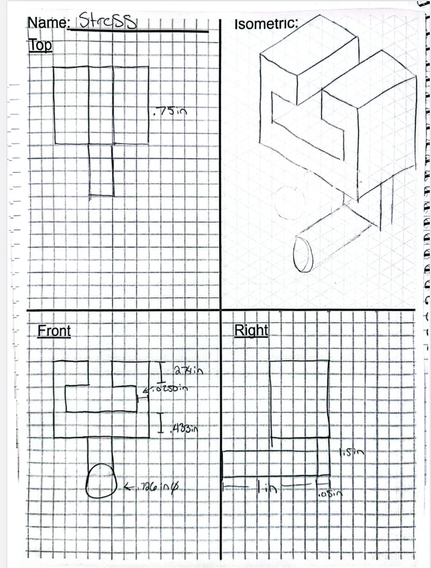

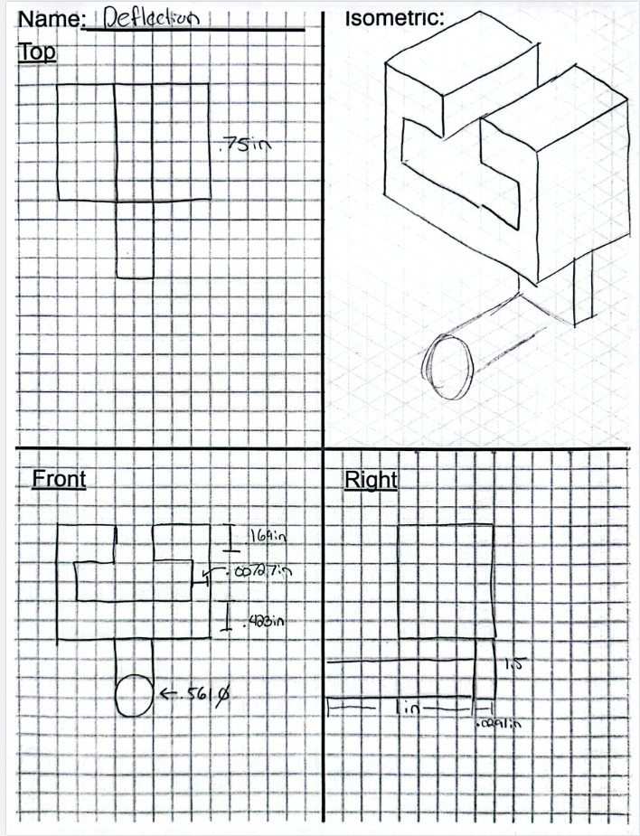
### Governing Failure Mode

For Feature A, stress governed the final required diameter. The stress analysis required a minimum diameter of 0.726 in, while the stiffness analysis required a minimum diameter of 0.561 in. The stress requirement was therefore 0.165 in larger. This showed that satisfying the deflection requirement does not automatically mean that a feature is strong enough to prevent yielding.

Feature C was also an interesting comparison because the two requirements were very close. Stress required a thickness of 0.433 in, while stiffness required 0.423 in. The difference was only 0.010 in. Even though stress still governed, this near-tie showed that both strength and stiffness can become important design constraints for the same feature.

## Communicate

### Error Propagation

One mistake made during the design process was initially choosing an incorrect width for one of the bracket features. Because that width was used in later cross-sectional area and moment-of-inertia calculations, the incorrect value affected multiple results downstream. After checking the bracket geometry and the given T-beam dimensions again, the width was corrected and the affected calculations were redone. This showed how an early dimensional mistake can propagate through several later calculations if the geometry is not checked carefully.

### Assumption Sensitivity

One important assumption was that the bracket and strap loading were symmetric. This allowed the 1200-lbf load carried by Feature C to split evenly into two 600-lbf reactions. Those 600-lbf reactions were then used to analyze Features D and E. If the load were not centered or the bracket were not symmetric, one side could carry more than 600 lbf. The dimensions of Features D and E on the more heavily loaded side would then need to increase to keep the stress and deformation within the required limits.

### Time Spent

The total time spent completing this assignment was approximately 4 hours. This included reviewing the assignment requirements, creating the free body diagrams, completing the stress and stiffness calculations, correcting calculation and dimensional errors, creating the multiview sketches, and organizing the final documentation.
