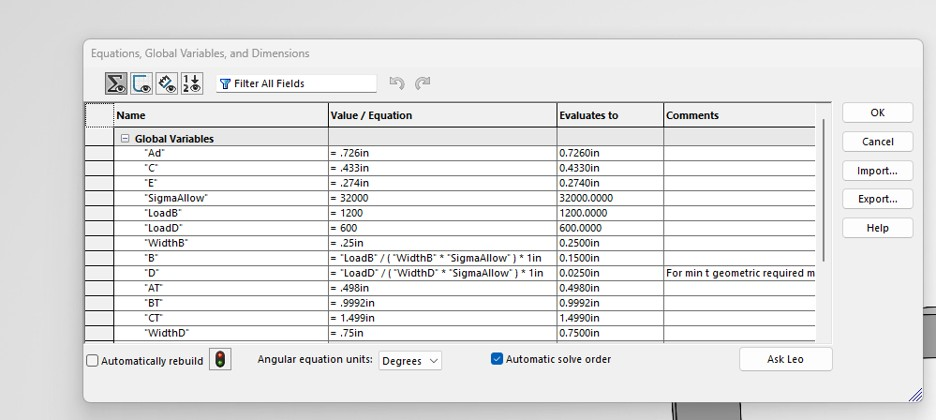
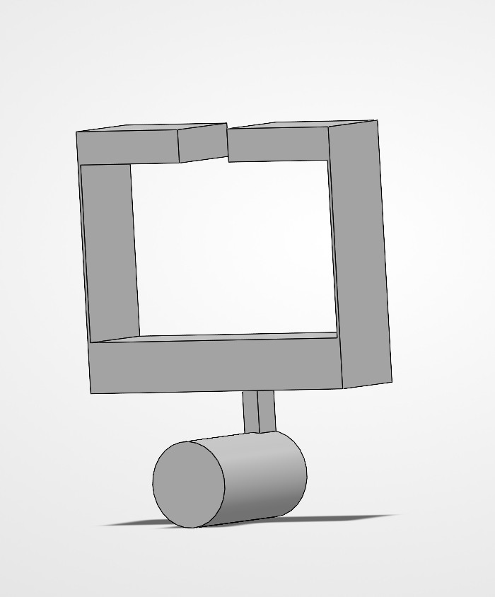

# A6 – Design for Strength and Stiffness II

## Objective

This assignment continued the bracket design from the previous strength and stiffness assignment. The calculated dimensions were used to build a parametric SolidWorks model, which was then used to make a fully dimensioned multiview drawing. The drawing included third-angle projection, sliding-fit dimensions, and engineering tolerances. A few dimensions had to be changed during modeling because the calculated minimum values did not always work perfectly with the actual geometry and fit requirements of the bracket.

## Analyze

### Parametric Design

The bracket was modeled in SolidWorks using global variables for the main dimensions.

Final dimensions:

- A = 0.726 in
- B = 0.150 in
- C = 0.433 in
- D = 0.027 in
- E = 0.274 in

Features B and D were both originally set up using parametric strength equations in SolidWorks. A, C, and E were entered as global variables using the values from the previous assignment.

For Feature B, the axial stress equation was used:

\[
t_B=\frac{P}{b\sigma_{allow}}
\]

Using a load of 1200 lbf, a width of 0.25 in, and an allowable stress of 32,000 psi gave a required Feature B thickness of 0.150 in.

The equation was entered directly into the SolidWorks global variables so the model dimension was connected to the calculation instead of only typing in the final calculated value.

### Errors and Changes

The biggest issue was with Feature B. The original width was 0.75 in, but that geometry did not work in the actual bracket. The width was changed to 0.25 in, which caused the required thickness to change from 0.050 in to 0.150 in.

The Feature B length was also changed from 1.50 in to 0.75 in so the geometry would fit correctly.

Feature D was also originally controlled by a parametric equation and gave a minimum thickness of 0.025 in. During modeling, the final dimension had to be increased slightly to 0.027 in so the geometry and tolerances worked correctly. Because of this change, Feature D was no longer being used exactly as the original equation result.

These changes showed that the minimum dimension found from an engineering calculation does not always become the exact final CAD dimension. The geometry, fit, and other parts of the model also have to work together.

## Decide

### Engineering Drawing

After the model was completed, a fully dimensioned multiview drawing was created in SolidWorks.

The drawing included:

- Front view
- Top view
- Right-side view
- Isometric view
- Third-angle projection
- Main bracket dimensions
- Sliding-fit dimensions
- Engineered tolerances

The sliding-fit dimensions were treated as more important because they control how the bracket fits over the rigid T-beam. Most normal dimensions were kept at two decimal places, while dimensions requiring more control were shown with greater precision.

A tighter X.XXX ± .005 tolerance was used on a sliding-fit dimension because it is a functional mating surface. A small change in this dimension could cause the bracket to become too loose or interfere with the T-beam.

A looser X.X ± .02 tolerance was used on a non-critical dimension where a small change would not affect the way the bracket fits or functions.

Using the tightest tolerance on every dimension would make the part harder and more expensive to manufacture without improving the function of the non-critical features.

[Download SolidWorks Drawing](Bracket-Drawling.SLDDRW)

## Communicate

### Parametric Design Reflection

Features B and D were both originally set up using equations in SolidWorks.

Feature B used the strength equation:

\[
t_B=\frac{P}{b\sigma_{allow}}
\]

When the Feature B width was changed from 0.75 in to 0.25 in, the equation-driven thickness changed from 0.050 in to 0.150 in. This showed how a parametric model can respond when one of the values used in the calculation changes.

Feature D originally calculated to 0.025 in using its parametric equation. During the final modeling process, I changed the actual dimension to 0.027 in so the geometry and tolerance requirements worked correctly. Because of this change, Feature D did not stay exactly controlled by the original calculated value.

Some parts of the model updated through the parameters, while other surrounding geometry still required manual changes.

### Tolerance Reflection

A tighter X.XXX ± .005 tolerance was used on a sliding-fit dimension because it is part of a mating surface between the bracket and the rigid T-beam. This area needs more control because too much variation could prevent the bracket from sliding onto the beam correctly.

A looser X.X ± .02 tolerance was used on a non-critical dimension because small changes in that feature would not affect the bracket's main function.

Using unnecessarily tight tolerances on non-critical features would make manufacturing more difficult and could increase cost because more precise machining and inspection would be required.

### Lessons Learned

One of the main things I learned from this assignment was that a calculated minimum dimension does not always become the exact final CAD dimension. The strength calculations give a starting point, but the geometry, sliding fits, and tolerances also have to work together.

I also learned more about using global variables and equations in SolidWorks. Setting up dimensions parametrically made it easier to see how changing one design value could affect another part of the model.

The drawing portion also showed how important tolerances are. Functional mating surfaces need tighter control, while non-critical dimensions can use looser tolerances.

### Time Spent

The total time spent completing this assignment was approximately 4 hours. This included building and correcting the CAD model, setting up global variables and equations, adjusting the geometry, creating the multiview drawing, adding dimensions and tolerances, and organizing the final documentation.
